# Module 5 Tutorial: Java Profiling

Advanced Programming (Even Semester 2024/2025) Tutorial Module 5

Khansa Khairunisa - 2306152462

*Server Configuration: Port 8081*

## Screenshot Performance Testing & Profiling

### Test Plan 1 (`/all-student`)

#### Before

Jmeter GUI
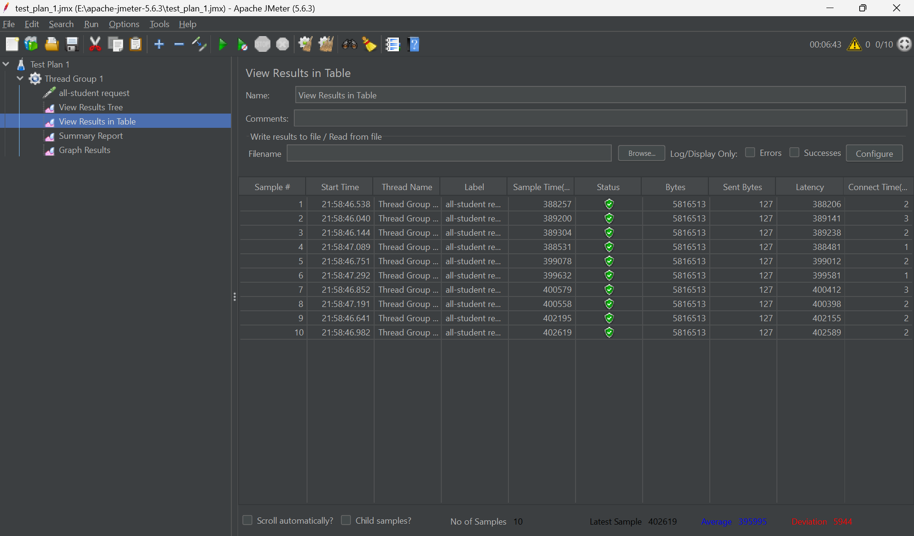

Jmeter Command Line
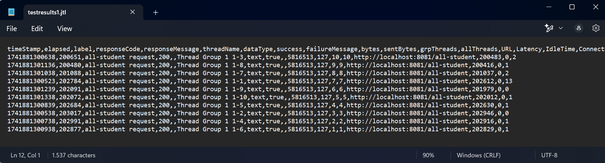

#### After

Jmeter GUI
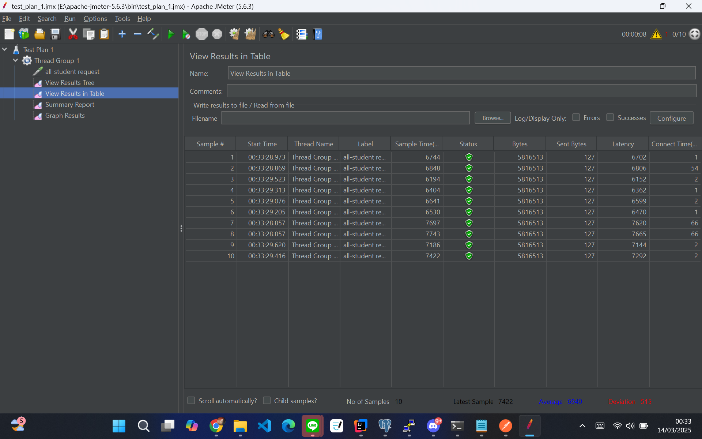

Jmeter Command Line
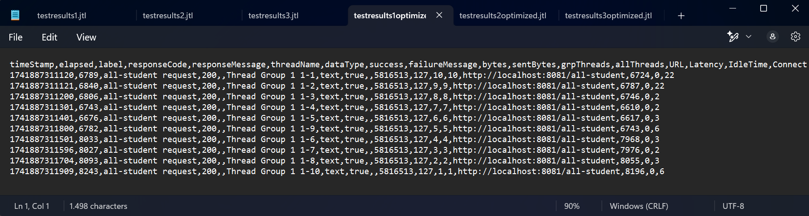

### Test Plan 2 (`/all-student-name`)

#### Before

Jmeter GUI

Jmeter Command Line
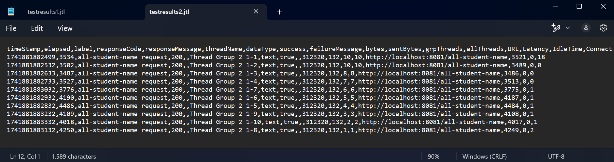

#### After

Jmeter GUI
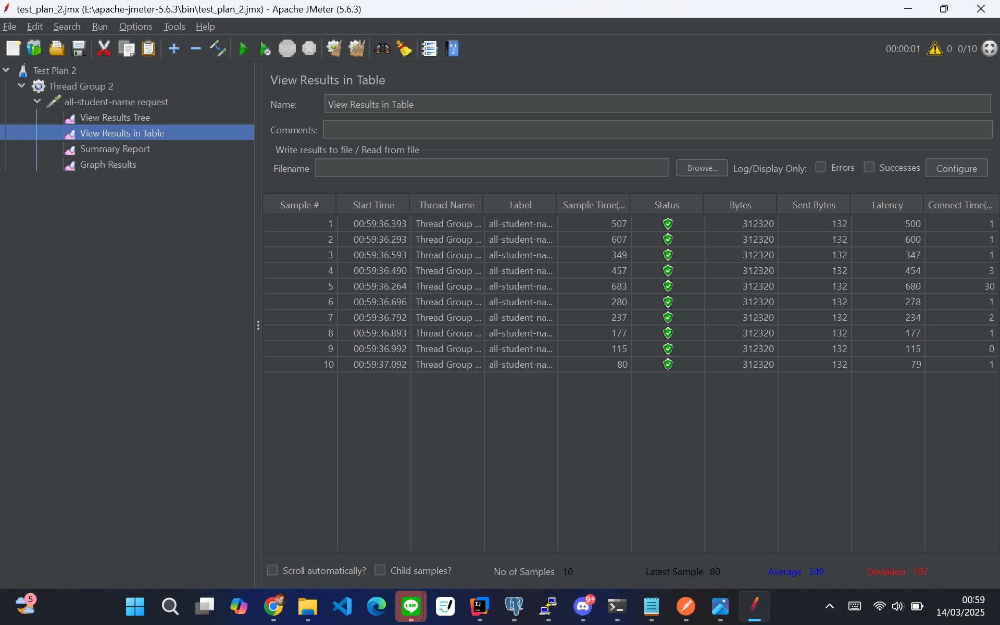

Jmeter Command Line
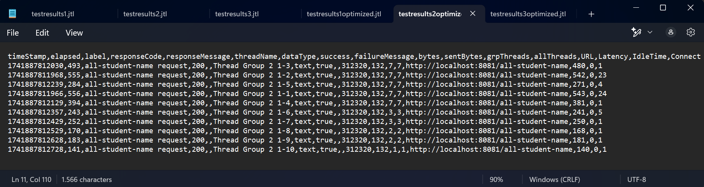

### Test Plan 3 (`/highest-gpa`)

#### Before

Jmeter GUI
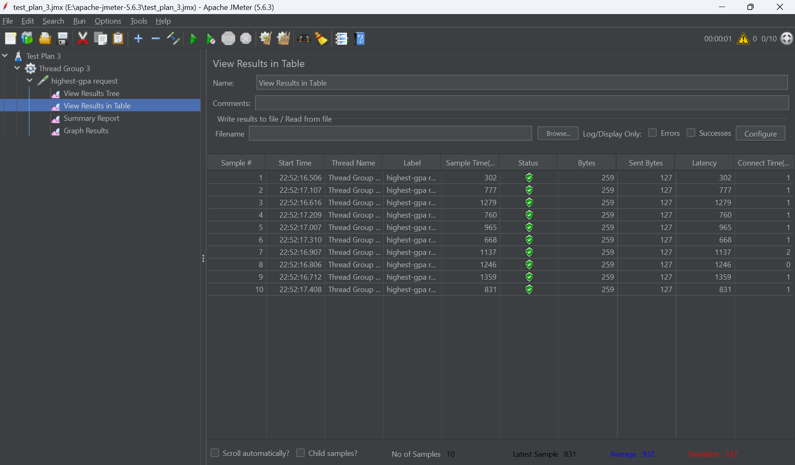

Jmeter Command Line
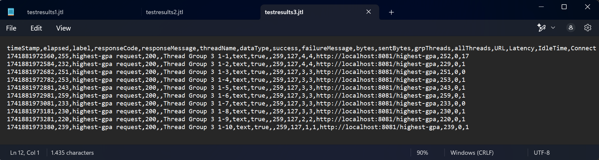

#### After

Jmeter GUI
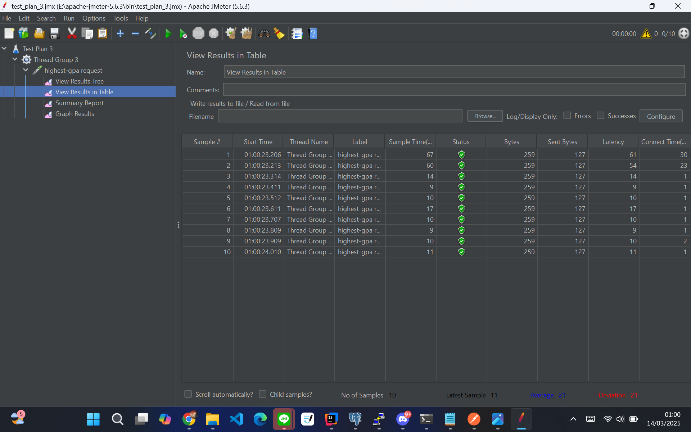

Jmeter Command Line
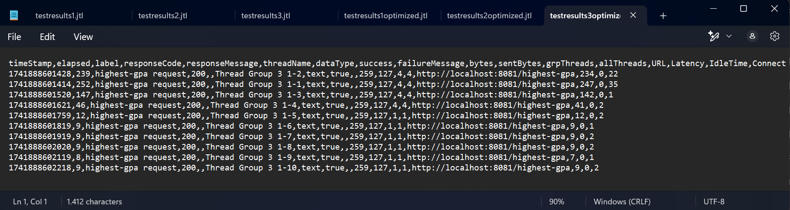

## Conlusion

Berdasarkan data perbandingan sebelum dan setelah optimisasi, dapat disimpulkan bahwa proses profiling dan optimisasi memberikan dampak yang sangat signifikan terhadap performa aplikasi. Peningkatan kinerja paling dramatis terlihat pada endpoint all-student yang mengalami penurunan waktu eksekusi hingga 98% (dari 200.000-402.000 ms menjadi hanya 6.100-8.200 ms).

Endpoint all-student-name juga mengalami peningkatan performa yang substansial dengan penurunan waktu eksekusi sekitar 93% (dari 3.400-9.000 ms menjadi 80-600 ms). Bahkan endpoint highest-gpa yang sebelumnya sudah cukup baik, masih dapat ditingkatkan performanya hingga 85% lebih cepat (dari 300-1.300 ms menjadi 8-200 ms).

Hasil pengukuran JMeter ini membuktikan bahwa upaya profiling dan optimisasi telah berhasil mengatasi bottleneck performa dan secara signifikan meningkatkan responsivitas sistem secara keseluruhan, memberikan pengalaman pengguna yang jauh lebih baik.

## Reflection

>What is the difference between the approach of performance testing with JMeter and profiling with IntelliJ Profiler in the context of optimizing application performance?

JMeter dan IntelliJ Profiler digunakan untuk mengoptimalkan kinerja aplikasi, tetapi dengan cara yang berbeda dan saling melengkapi. JMeter digunakan untuk menguji performa aplikasi dari sisi sistem dengan mensimulasikan banyak pengguna yang mengakses aplikasi secara bersamaan. Hal ini membantu melihat bagaimana aplikasi menangani beban tinggi dan memastikan tetap responsif dalam kondisi nyata. Sementara itu, IntelliJ Profiler berfokus pada analisis mendalam di dalam kode aplikasi, seperti mencari tahu bagian kode yang berjalan lambat, mendeteksi kebocoran memori, dan menemukan *bottleneck* yang mempengaruhi kinerja. Jika JMeter lebih cocok untuk memahami bagaimana aplikasi berperilaku di lingkungan produksi, IntelliJ Profiler membantu pengembang memperbaiki masalah performa langsung di dalam kode agar aplikasi berjalan lebih efisien.

>How does the profiling process help you in identifying and understanding the weak points in your application?

Proses *profiling* membantu mengidentifikasi dan memahami titik lemah dalam aplikasi dengan cara mengukur secara detail waktu eksekusi setiap fungsi, sehingga dapat menemukan metode yang berjalan lambat atau tidak efisien. *Profiling* juga memvisualisasikan penggunaan memori untuk mendeteksi kebocoran dan penggunaan yang berlebihan, serta memetakan beban CPU pada berbagai bagian aplikasi untuk mengidentifikasi kode yang membutuhkan sumber daya berlebih. Selain itu, *profiling* melacak *thread* dan konkurensi untuk menemukan *deadlock* atau *race condition*, menganalisis panggilan database yang tidak optimal, serta memantau operasi I/O yang menjadi hambatan kinerja. Dengan data tersebut, pengembang dapat mengidentifikasi *bottleneck* secara tepat dan mengoptimalkan aplikasi berdasarkan bukti nyata, bukan sekadar intuisi, sehingga proses perbaikan menjadi lebih terarah dan efektif.

>Do you think IntelliJ Profiler is effective in assisting you to analyze and identify bottlenecks in your application code?

Menurut saya, IntelliJ Profiler sangat efektif dalam membantu menganalisis dan mengidentifikasi *bottlenecks* dalam kode aplikasi karena menyediakan visualisasi yang komprehensif tentang penggunaan CPU, alokasi memori, dan perilaku thread langsung di dalam lingkungan pengembangan yang sama dengan tempat kode ditulis. Intellij Profiler memungkinkan pengembang untuk dengan mudah melacak metode yang memakan waktu lama, melihat hierarki panggilan, dan mengidentifikasi objek yang menyebabkan kebocoran memori tanpa harus beralih ke aplikasi terpisah. Integrasi lancar dengan IDE membuat proses analisis performa menjadi bagian alami dari siklus pengembangan, sehingga pengembang dapat segera mengetahui masalah performa dan memperbaikinya dengan cepat sambil melihat langsung kode sumber yang bermasalah.

>What are the main challenges you face when conducting performance testing and profiling, and how do you overcome these challenges?

Salah satu tantangan dalam pengujian performa dan *profiling* adalah kurangnya pengalaman dalam menggunakan alat/*tools* yang tersedia, sehingga saya mengalami kesulitan dalam memahami dan mengoperasikan fitur-fiturnya. Untuk mengatasinya, saya mencari bantuan dari rekan yang lebih berpengalaman serta mempelajari dokumentasi dan tutorial yang relevan. Selain itu, menilai efektivitas optimasi yang telah dilakukan juga menjadi tantangan, karena sulit menentukan apakah perbaikan tersebut sudah cukup signifikan. Oleh karena itu, setelah melakukan optimasi, saya menjalankan kembali pengujian performa untuk membandingkan hasil sebelum dan sesudah perubahan, sehingga dapat mengukur peningkatan yang dicapai dan mengidentifikasi area yang masih perlu diperbaiki.

>What are the main benefits you gain from using IntelliJ Profiler for profiling your application code?

Keuntungan utama menggunakan IntelliJ Profiler adalah efisiensi dalam mendeteksi masalah performa tanpa perlu alat/*tools* tambahan. *Profiler* secara otomatis mengurutkan metode berdasarkan waktu eksekusi, sehingga saya dapat langsung menemukan *bottleneck* dalam kode tanpa perlu analisis manual yang rumit.

>How do you handle situations where the results from profiling with IntelliJ Profiler are not entirely consistent with findings from performance testing using JMeter?

Jika hasil dari IntelliJ Profiler dan JMeter tidak konsisten, langkah pertama yang saya lakukan adalah mengecek kembali konfigurasi di kedua *tools* tersebut. Perbedaan dalam jumlah thread, beban kerja, atau pengaturan koneksi bisa jadi penyebab hasil yang berbeda. Jika setelah disesuaikan masih ada perbedaan, saya akan mencari referensi tambahan di internet. Banyak developer lain mungkin pernah mengalami masalah serupa dan sudah menemukan solusinya, sehingga saya bisa belajar dari pengalaman mereka dan mencoba cara yang lebih tepat.

>What strategies do you implement in optimizing application code after analyzing results from performance testing and profiling? How do you ensure the changes you make do not affect the application's functionality?

Dalam proses optimasi kode aplikasi setelah melakukan analisis hasil pengujian dan *profiling*, saya menerapkan beberapa strategi utama, seperti mengurangi kompleksitas algoritma dengan mengganti proses iterasi manual menjadi memanfaatkan metode repository (`findAll()` menjadi `findFirstByOrderByGpaDesc()`), mengoptimalkan operasi database dengan menghindari pengambilan data yang tidak perlu, dan memperbaiki manipulasi string dengan mengganti concatenation (operator +=) menjadi StringBuilder untuk mengurangi alokasi memori yang berlebihan. Untuk memastikan fungsionalitas aplikasi tetap terjaga setelah perubahan, saya memastikan bahwa logika tetap sama, hanya pendekatan implementasinya yang diubah untuk meningkatkan performa, serta menjalankan pengujian kembali untuk memvalidasi hasilnya, yang terbukti memberikan peningkatan performa signifikan seperti yang ditunjukkan dari pengukuran waktu eksekusi endpoint.